# PRISM System - Data Flow Diagrams (DFD)

**Privacy Resilience & Intelligent Security Module**  
**Complete Data Flow Analysis**

---

## 📊 DFD Level 0 - Context Diagram

**Purpose:** Shows PRISM system as a single process with external entities and data flows.

```mermaid
graph TB
    %% External Entities
    User[("👤 Web User")]
    Websites[("🌐 Websites<br/>(Target Pages)")]
    ThreatDB[("🛡️ External<br/>Threat DBs")]
    Backend[("☁️ Backend<br/>Server")]
    
    %% Main System Process
    PRISM["⬢ PRISM EXTENSION<br/>SYSTEM<br/>(Process 0)<br/>━━━━━━━━━━━━━━<br/>• Tracker Blocking<br/>• ML Threat Detection<br/>• Privacy Scoring<br/>• Fingerprint Protection"]
    
    %% Input Flows to PRISM
    User -->|"1️⃣ Browse Request<br/>(URL, Headers, Prefs)"| PRISM
    User -->|"2️⃣ Settings Config<br/>(Privacy Level, Rules)"| PRISM
    User -->|"3️⃣ Report Threats<br/>(URL, Description)"| PRISM
    
    Websites -->|"5️⃣ Web Content<br/>(HTML, CSS, JS)"| PRISM
    Websites -->|"6️⃣ Tracking Scripts<br/>(Analytics, Ads)"| PRISM
    Websites -->|"7️⃣ Cookies<br/>(Session, Tracking)"| PRISM
    
    ThreatDB -->|"8️⃣ Threat Data<br/>(Malicious URLs)"| PRISM
    ThreatDB -->|"9️⃣ Safe Browsing API<br/>(Risk Scores)"| PRISM
    ThreatDB -->|"🔟 PhishTank Data<br/>(Phishing URLs)"| PRISM
    
    %% Output Flows from PRISM
    PRISM -->|"1️⃣1️⃣ Privacy Alerts<br/>(Warnings, Tips)"| User
    PRISM -->|"1️⃣2️⃣ Privacy Score<br/>(0-100, Risk Level)"| User
    PRISM -->|"1️⃣3️⃣ Analytics Reports<br/>(Trackers, Timeline)"| User
    PRISM -->|"1️⃣4️⃣ Educational Tips<br/>(Best Practices)"| User
    
    PRISM -->|"1️⃣5️⃣ Blocked Requests<br/>(Tracker Domains)"| Websites
    PRISM -->|"1️⃣6️⃣ Modified Content<br/>(Warnings, Fake Data)"| Websites
    
    PRISM -->|"1️⃣7️⃣ Threat Reports<br/>(Detected Threats)"| Backend
    PRISM -->|"1️⃣8️⃣ Sync Data<br/>(Settings, History)"| Backend
    
    %% Styling
    classDef entityStyle fill:#4f46e5,stroke:#312e81,stroke-width:3px,color:#fff
    classDef processStyle fill:#059669,stroke:#065f46,stroke-width:4px,color:#fff,font-weight:bold
    
    class User,Websites,ThreatDB,Backend entityStyle
    class PRISM processStyle
```



### Data Flow Descriptions (Level 0)

| Flow # | Name | Description | Data Content |
|--------|------|-------------|--------------|
| 1 | Browse Request | User initiates web browsing | URL, HTTP headers, user preferences |
| 2 | Settings Config | User configures privacy settings | Privacy level, blocking rules, whitelist |
| 3 | Report Threats | User reports suspicious sites | URL, threat type, description |
| 5 | Web Content | Website delivers content | HTML, CSS, JS, images, cookies |
| 6 | Tracking Scripts | Trackers attempt to run | Analytics scripts, ad trackers, pixels |
| 7 | Cookies | Sites set/read cookies | Session cookies, tracking cookies |
| 8 | Threat Data | External threat databases | Malicious URLs, phishing domains |
| 9 | Safe Browsing API | Google Safe Browsing data | Threat classifications, risk scores |
| 10 | PhishTank Data | PhishTank API responses | Verified phishing URLs |
| 11 | Privacy Alerts | System warns user | Threat warnings, fingerprint attempts |
| 12 | Privacy Score | Real-time privacy metrics | Score (0-100), risk level, factors |
| 13 | Analytics Reports | Detailed privacy reports | Blocked trackers, cookies, timeline |
| 14 | Educational Tips | Privacy education content | Tips, best practices, explanations |
| 15 | Blocked Requests | System blocks malicious content | Blocked tracker domains, requests |
| 16 | Modified Content | System modifies web content | Injected warnings, fake data |
| 17 | Threat Reports | System reports to backend | Detected threats, user reports |
| 18 | Sync Data | Cloud synchronization | Settings, history, trust levels |

---

## 🔍 DFD Level 1 - Detailed System Diagram

**Purpose:** Breaks down PRISM system into major subsystems and their interactions.

```mermaid
graph TB
    %% External Entities
    User[("👤 WEB USER")]
    Websites[("🌐 WEBSITES")]
    ThreatAPIs[("🛡️ EXTERNAL<br/>THREAT APIs")]
    BackendServer[("☁️ BACKEND<br/>SERVER")]
    
    %% Data Stores
    D1[("💾 D1: USER<br/>SETTINGS<br/>10-50 KB")]
    D2[("📊 D2: STATISTICS<br/>STORE<br/>100-500 KB")]
    D3[("🗂️ D3: TRACKER<br/>DATABASE<br/>200+ domains")]
    D4[("⚡ D4: BLOCK LIST<br/>CACHE<br/>20-50 KB")]
    D5[("🧠 D5: ML MODEL<br/>TensorFlow.js<br/>214 KB")]
    D6[("📜 D6: THREAT<br/>HISTORY<br/>500KB-2MB")]
    D7[("🎓 D7: TRAINING<br/>DATA<br/>100KB-10MB")]
    
    %% Main Processes
    P1["📱 PROCESS 1:<br/>USER INTERFACE<br/>━━━━━━━━━━━━<br/>• Popup UI<br/>• Settings Panel<br/>• Analytics Dashboard<br/>• Report Export"]
    
    P2["⚙️ PROCESS 2:<br/>BACKGROUND<br/>SERVICE WORKER<br/>━━━━━━━━━━━━<br/>• Request Interception<br/>• Tracker Blocking<br/>• ML Inference<br/>• Stats Aggregation"]
    
    P3["🛡️ PROCESS 3:<br/>PRIVACY<br/>GUARDIAN<br/>━━━━━━━━━━━━<br/>• Request Filtering<br/>• Cookie Analysis<br/>• Fingerprint Blocking<br/>• Privacy Scoring"]
    
    P4["🔧 PROCESS 4:<br/>CONTENT SCRIPT<br/>INJECTOR<br/>━━━━━━━━━━━━<br/>• DOM Manipulation<br/>• Warning Overlay<br/>• Fake Data Gen<br/>• Form Detection"]
    
    P5["🤖 PROCESS 5:<br/>ML THREAT<br/>DETECTOR<br/>━━━━━━━━━━━━<br/>• Feature Extraction<br/>• 28 Features<br/>• Inference Engine<br/>• Threat Classification"]
    
    P6["🔄 PROCESS 6:<br/>BACKEND SYNC<br/>SERVICE<br/>━━━━━━━━━━━━<br/>• Cloud Sync<br/>• Report Aggregation<br/>• Intelligence Updates"]
    
    %% User Interactions
    User -->|"1.1 Settings Commands<br/>1.2 Browse Request"| P1
    P1 -->|"11-14 Alerts, Score,<br/>Reports, Tips"| User
    
    %% Process 1 - UI
    P1 <-->|"1.3 User Config"| D1
    P1 <-->|"1.4 Display Metrics"| D2
    
    %% Process 2 - Background Worker
    D1 -->|"1.5 Settings Data"| P2
    P2 -->|"1.8 Stats Updates"| D2
    P2 <-->|"2.1 URL Check"| D3
    P2 <-->|"2.2 Block Request"| D4
    P2 <-->|"2.3 Analyze Features"| D5
    P2 -->|"2.4 Update Stats"| D2
    
    %% Process 3 - Privacy Guardian
    D3 -->|"Pattern Matching"| P3
    D4 -->|"Blocked Domains"| P3
    P3 -->|"Privacy Score"| D2
    
    %% Process 3 to Process 4
    P3 -->|"3.1 Block Command<br/>3.2 Modify Request<br/>3.3 Privacy Score"| P4
    
    %% Process 4 - Content Scripts
    P4 <-->|"4.1 Warning Inject<br/>4.2 Block Script<br/>4.3 Form Data"| Websites
    Websites -->|"5.1 Content Delivery<br/>5.2 Tracking Scripts"| P4
    
    %% Process 5 - ML Detector
    P2 -->|"URL for Analysis"| P5
    D5 -->|"Model Weights"| P5
    P5 -->|"5.3 Threat Classification"| D6
    P5 -->|"5.4 Training Samples"| D7
    D6 -->|"5.5 Historical Data"| P5
    D7 -->|"5.6 Model Updates"| P5
    
    %% Process 6 - Backend Sync
    P2 -->|"Sync Request"| P6
    D1 -->|"Settings Backup"| P6
    D6 -->|"Threat Reports"| P6
    P6 <-->|"6.1 Settings Sync"| BackendServer
    P6 <-->|"6.2 Threat Intelligence"| ThreatAPIs
    
    %% External APIs to System
    ThreatAPIs -->|"8-10 Threat Data,<br/>Safe Browsing,<br/>PhishTank"| P2
    
    %% Styling
    classDef entityStyle fill:#4f46e5,stroke:#312e81,stroke-width:3px,color:#fff,font-weight:bold
    classDef processStyle fill:#059669,stroke:#065f46,stroke-width:3px,color:#fff,font-weight:bold
    classDef storeStyle fill:#f59e0b,stroke:#b45309,stroke-width:3px,color:#000,font-weight:bold
    
    class User,Websites,ThreatAPIs,BackendServer entityStyle
    class P1,P2,P3,P4,P5,P6 processStyle
    class D1,D2,D3,D4,D5,D6,D7 storeStyle
```



---

## 📂 Data Stores (Detailed)

### D1: User Settings Storage
**Location:** Chrome Storage API (chrome.storage.local)  
**Purpose:** Persist user preferences and configuration  
**Data Structure:**
```typescript
{
  privacyLevel: 'strict' | 'balanced' | 'relaxed',
  blockingEnabled: boolean,
  trackersEnabled: boolean,
  cookiesEnabled: boolean,
  fingerprintProtection: boolean,
  mlDetectionEnabled: boolean,
  notificationsEnabled: boolean,
  educationalTips: boolean,
  whitelistedDomains: string[],
  blacklistedDomains: string[]
}
```
**Size:** ~10-50 KB  
**Retention:** Permanent (until user clears)

---

### D2: Statistics Store
**Location:** Chrome Storage API + Memory Cache  
**Purpose:** Real-time privacy metrics per website  
**Data Structure:**
```typescript
{
  [domain: string]: {
    trackersBlocked: number,
    cookiesDetected: number,
    thirdPartyScripts: number,
    fingerprintAttempts: number,
    privacyScore: number,
    riskLevel: string,
    lastUpdated: timestamp,
    timeline: Array<{
      timestamp: number,
      event: string,
      tracker: string
    }>
  }
}
```
**Size:** ~100-500 KB  
**Retention:** 7 days (auto-cleanup)

---

### D3: Tracker Database
**Location:** Static data in extension bundle  
**Purpose:** Comprehensive list of known trackers  
**Data Structure:**
```typescript
{
  domains: string[],           // 200+ tracker domains
  patterns: RegExp[],          // 27 regex patterns
  categories: {
    analytics: string[],
    advertising: string[],
    social: string[],
    marketing: string[],
    fingerprinting: string[],
    cookieConsent: string[],
    heatMapping: string[]
  }
}
```
**Size:** ~50-100 KB  
**Retention:** Permanent (updated with extension)

---

### D4: Block List Cache
**Location:** Memory (Service Worker)  
**Purpose:** Fast lookup for blocked requests  
**Data Structure:**
```typescript
Set<string> {
  'doubleclick.net',
  'google-analytics.com',
  'facebook.com/tr',
  // ... 200+ domains
}
```
**Size:** ~20-50 KB  
**Retention:** Session (cleared on restart)

---

### D5: ML Model Store
**Location:** Extension assets (TensorFlow.js model)  
**Purpose:** Client-side phishing detection  
**Data Structure:**
```
/models/
  └── phishing_detector/
      ├── model.json           # Model architecture
      ├── weights.bin          # Trained weights (214.3 KB)
      └── metadata.json        # Feature names, version
```
**Size:** ~250 KB  
**Retention:** Permanent (versioned)

---

### D6: Threat History
**Location:** Chrome Storage API (chrome.storage.local)  
**Purpose:** Historical threat detection data  
**Data Structure:**
```typescript
{
  detectedThreats: Array<{
    url: string,
    threatType: 'phishing' | 'malware' | 'suspicious',
    confidence: number,
    timestamp: number,
    userAction: 'blocked' | 'allowed' | 'reported',
    mlScore: number,
    features: number[]  // 28 features
  }>,
  scoreHistory: Array<{
    domain: string,
    score: number,
    timestamp: number
  }>
}
```
**Size:** ~500 KB - 2 MB  
**Retention:** 7 days (configurable)

---

### D7: ML Training Data
**Location:** Local filesystem (`ml/data/`)  
**Purpose:** Train and improve ML models  
**Data Structure:**
```csv
url,label
https://www.google.com,0
http://g00gle.com/verify,1
http://paypal-verify.tk,1
...
```
**Size:** ~100 KB - 10 MB  
**Retention:** Development only (not in production extension)

---

## 🔄 Process Descriptions (Detailed)

### Process 1: User Interface (Popup UI)
**Inputs:**
- User interactions (clicks, settings changes)
- Real-time statistics from D2
- Privacy scores from Background Service Worker

**Processing:**
- Render React components with real-time data
- Handle user settings changes
- Display analytics dashboard
- Show threat warnings
- Export reports (JSON/CSV)

**Outputs:**
- Updated UI display
- Settings commands to Background Worker
- User reports to Backend Sync

**Technology:** React 18, TypeScript, Tailwind CSS  
**Files:** `src/popup/App.tsx`, `Analytics.tsx`, `Settings.tsx`

---

### Process 2: Background Service Worker
**Inputs:**
- Web requests (chrome.webRequest)
- User settings from D1
- ML model from D5
- External threat data

**Processing:**
- Intercept all web requests
- Check URL against tracker database (D3)
- Apply blocking rules from D4
- Run ML inference for phishing detection
- Calculate privacy scores
- Aggregate statistics
- Handle message passing between components

**Outputs:**
- Blocked/modified requests
- Updated statistics to D2
- Warnings to Content Script
- Analytics data to UI

**Technology:** TypeScript, Chrome Extension APIs  
**Files:** `src/background/service-worker.ts`

---

### Process 3: Privacy Guardian
**Inputs:**
- HTTP requests from websites
- Cookie data from chrome.cookies
- Fingerprinting attempts from Content Script
- User settings from D1

**Processing:**
- Filter requests based on tracker database
- Analyze cookies (first-party vs third-party)
- Block fingerprinting scripts
- Calculate multi-factor privacy score:
  ```typescript
  score = 100 
    - (trackersBlocked * 2)
    - (cookies * 1)
    - (fingerprintAttempts * 5)
    - (thirdPartyScripts * 1.5)
    + (hasHTTPS ? 10 : 0)
  ```
- Apply protection rules

**Outputs:**
- Block commands to web requests
- Modify commands to Content Script
- Privacy scores to Statistics Store (D2)
- Risk level classifications

**Technology:** TypeScript, Pattern Matching, Algorithms  
**Files:** `src/utils/enhanced-privacy-scorer.ts`, `enhanced-tracker-database.ts`

---

### Process 4: Content Script Injector
**Inputs:**
- Page DOM from loaded websites
- Warning commands from Background Worker
- Fingerprint blocking rules
- Form detection triggers

**Processing:**
- Inject warning overlays for phishing sites
- Block fingerprinting scripts (Canvas, WebGL, Audio)
- Detect forms and sensitive input fields
- Generate fake data for privacy protection
- Modify page content for security

**Outputs:**
- DOM modifications (warning overlays)
- Blocked JavaScript execution
- Form data to Background Worker
- Fingerprint attempt notifications

**Technology:** TypeScript, DOM APIs, Shadow DOM  
**Files:** `src/content/content-script.ts`, `warning-overlay.ts`

---

### Process 5: ML Threat Detector
**Inputs:**
- URLs from web requests
- Trained ML model from D5 (214.3 KB)
- Feature extraction parameters (28 features)

**Processing:**
- Extract URL features:
  * Structural: length, subdomains, parameters
  * Domain: entropy, suspicious TLD, IP address
  * Content: sensitive keywords, patterns
  * Statistical: character ratios, entropy scores
- Run ML inference using TensorFlow.js or Ensemble model:
  ```python
  # Features extracted
  features = [
    url_length, domain_length, num_subdomains,
    has_https, has_ip_address, url_entropy,
    domain_entropy, num_hyphens, num_digits,
    # ... 19 more features
  ]
  
  # Prediction
  prediction = model.predict([features])
  confidence = prediction_proba[1]  # Phishing probability
  ```
- Classify threat level
- Generate confidence score (0-100%)

**Outputs:**
- Threat classification (legitimate/phishing/malware)
- Confidence score
- Feature vector to Training Data (D7)
- Detection events to Threat History (D6)

**Technology:** Python, TensorFlow.js, scikit-learn  
**Files:** `ml/src/models/phishing_detector.py`, `ml/src/features/url_features.py`

---

### Process 6: Backend Sync Service
**Inputs:**
- User settings from D1
- Threat reports from User
- Detection events from ML Detector
- Sync requests from multiple devices

**Processing:**
- Synchronize settings across devices
- Aggregate user threat reports
- Update threat intelligence from external APIs
- Store anonymized statistics
- Push model updates

**Outputs:**
- Synced settings to all devices
- Updated threat database
- Model updates to D5
- Analytics to backend database

**Technology:** Node.js, Express, MongoDB  
**Files:** `backend/src/controllers/`, `backend/src/services/`

---

## 🌊 Data Flow Scenarios

### Scenario 1: User Visits Website
```
1. User enters URL in browser
   ↓
2. chrome.webRequest intercepts (Background Worker)
   ↓
3. Check URL against Tracker Database (D3)
   ↓
4. Run ML Threat Detection (Process 5)
   ↓
5. If threat detected → Block + Show Warning (Content Script)
   If safe → Allow + Track statistics
   ↓
6. Update Statistics Store (D2)
   ↓
7. Calculate Privacy Score (Process 3)
   ↓
8. Display in Popup UI (Process 1)
```

### Scenario 2: Tracker Blocking
```
1. Website loads tracking script (e.g., google-analytics.com)
   ↓
2. Background Worker intercepts request
   ↓
3. Match against Tracker Database (D3)
   ↓
4. Found → Block request (chrome.webRequest.cancel)
   ↓
5. Increment blocked counter in Statistics (D2)
   ↓
6. Log event in Threat History (D6)
   ↓
7. Update Privacy Score
   ↓
8. Notify User Interface
```

### Scenario 3: Fingerprint Protection
```
1. Website attempts Canvas fingerprinting
   ↓
2. Content Script detects canvas.toDataURL() call
   ↓
3. Block execution + Return fake data
   ↓
4. Notify Background Worker
   ↓
5. Increment fingerprint counter (D2)
   ↓
6. Reduce Privacy Score
   ↓
7. Show alert in Popup
```

### Scenario 4: ML Phishing Detection
```
1. User navigates to suspicious URL
   ↓
2. Background Worker extracts 28 features
   ↓
3. Load ML model from D5
   ↓
4. Run inference (TensorFlow.js)
   ↓
5. Confidence > 80% → PHISHING
   ↓
6. Content Script injects warning overlay
   ↓
7. Store detection in Threat History (D6)
   ↓
8. Offer "Report" option to Backend
```

### Scenario 5: Settings Synchronization
```
1. User changes privacy level on Device A
   ↓
2. Update User Settings (D1)
   ↓
3. Trigger sync event to Backend (Process 6)
   ↓
4. Backend stores in MongoDB
   ↓
5. Push notification to Device B
   ↓
6. Device B updates D1
   ↓
7. Apply new settings to Privacy Guardian
```

---

## 📊 Data Flow Metrics

### Volume Estimates (per day, per user)

| Data Flow | Volume | Frequency | Peak Load |
|-----------|--------|-----------|-----------|
| Web Requests Analyzed | 500-2000 | Continuous | 10 req/sec |
| Trackers Blocked | 100-500 | Per page load | 50/page |
| Cookies Detected | 50-200 | Per session | 20/site |
| ML Predictions | 10-50 | Per navigation | 1-2/min |
| Privacy Score Updates | 100-300 | Real-time | 5/min |
| Statistics Writes | 500-1000 | Per event | 20/min |
| UI Updates | 50-100 | User interaction | 10/min |
| Sync Operations | 5-10 | Background | 1/hour |

### Storage Requirements

| Store | Size | Growth Rate | Cleanup |
|-------|------|-------------|---------|
| D1 (Settings) | 10-50 KB | Static | Manual |
| D2 (Statistics) | 100-500 KB | 50 KB/day | 7-day auto |
| D3 (Trackers) | 50-100 KB | Static | Extension update |
| D4 (Cache) | 20-50 KB | Session | Restart |
| D5 (ML Model) | 250 KB | Static | Version update |
| D6 (Threat History) | 500 KB - 2 MB | 100 KB/day | 7-day auto |
| D7 (Training) | 100 KB - 10 MB | Development | Manual |

---

## 🔐 Security Considerations in Data Flow

### Data Protection Measures

1. **Encryption in Transit**
   - All external API calls use HTTPS
   - Certificate pinning for critical endpoints
   - TLS 1.3 minimum

2. **Encryption at Rest**
   - Sensitive settings encrypted with AES-256
   - User reports anonymized before storage
   - Threat data hashed for privacy

3. **Data Minimization**
   - No personally identifiable information (PII) collected
   - URLs hashed before ML analysis
   - Anonymous telemetry only

4. **Access Control**
   - Chrome Extension permissions model
   - Content scripts sandboxed
   - Service worker isolated

5. **Data Retention**
   - 7-day automatic cleanup for D2, D6
   - User can clear all data anytime
   - No indefinite storage

---

## 🔄 Data Flow Optimization

### Performance Optimizations

1. **Caching Strategy**
   - L1: Memory cache (D4) - 20KB, instant access
   - L2: Chrome Storage (D2) - 500KB, <10ms access
   - L3: Backend (D6) - Unlimited, <200ms access

2. **Batch Processing**
   - Statistics aggregated every 5 seconds
   - ML predictions batched for efficiency
   - Network requests debounced

3. **Lazy Loading**
   - ML model loaded on-demand
   - Analytics data fetched when UI opened
   - Historical data paginated

4. **Data Compression**
   - Statistics compressed before storage
   - JSON responses gzipped
   - Model weights quantized

---

## 📈 Scalability Considerations

### Horizontal Scaling (Backend)
- Load balancer distributes sync requests
- MongoDB sharding for large user base
- Redis cache for frequent queries
- CDN for static assets (ML models)

### Vertical Scaling (Client)
- Web Workers for heavy computations
- IndexedDB for large datasets
- Service Worker caching
- Memory management with cleanup

---

## 🎯 Summary

### DFD Level 0 Highlights
- **4 External Entities:** Web User, Websites, External Threat DBs, Backend Server
- **1 Main Process:** PRISM Extension System
- **18 Data Flows:** Covering all interactions

### DFD Level 1 Highlights
- **6 Major Processes:** UI, Background Worker, Privacy Guardian, Content Injector, ML Detector, Backend Sync
- **7 Data Stores:** Settings, Statistics, Trackers, Cache, ML Model, Threat History, Training Data
- **20+ Data Flows:** Detailed inter-process communication

### Key Insights
- **Real-time Processing:** Most data flows occur in milliseconds
- **Privacy-First:** No PII collected, local processing preferred
- **Intelligent Blocking:** ML-powered with 94.4% accuracy
- **Efficient Storage:** 7-day retention with auto-cleanup
- **Scalable Architecture:** Client-heavy processing, minimal backend dependency

---

**Document Version:** 1.0  
**Last Updated:** November 6, 2025  
**Status:** Complete - DFD Level 0 & Level 1  
**Next Update:** Phase 5 ML integration (TensorFlow.js deployment)
